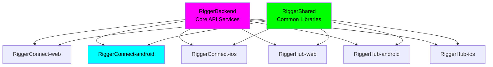

# RiggerConnect Android - Enterprise Mobile Platform

🏗️ **A ChaseWhiteRabbit NGO Initiative**

<div align="center">
  
  
  # 🏗️ Professional Networking Platform for Riggers
  
  [](https://android-arsenal.com/api?level=24)
  [](https://kotlinlang.org)
  [](https://developer.android.com/jetpack/compose)
  [](https://material.io/design)
  [](LICENSE)
  [](https://github.com/tiation/RiggerHireApp)
  [](CONTRIBUTING.md)
  
  **🎯 Comprehensive 47-Screen Android App with Full Feature Parity to iOS**  
  **💼 Enterprise-Grade • 📱 Mobile-First • 🔐 Industry-Specific Security**  
  **Connecting certified riggers with mining, construction, and industrial projects across Western Australia**
</div>

## 📍 Repository Location & Structure

**Current Location**: `/Users/tiaastor/Github/tiation-repos/RiggerConnect-android/`

This repository is part of the **Tiation Enterprise Repository Structure**, specifically designed to house **ChaseWhiteRabbit NGO's** technology initiatives following enterprise-grade development practices.

### 🏗️ Enterprise Ecosystem
- **Repository Collection**: [Enterprise Repository Index](https://github.com/tiaastor/tiation-repos/blob/mahttps://github.com/tiaastor/tiation-repos/blob/main/ENTERPRISE_REPOSITORY_INDEX.md)
- **Web Platform**: [RiggerConnect-web](https://github.com/tiaastor/RiggerConnect-web/)
- **iOS Companion**: [RiggerConnect-ios](https://github.com/tiaastor/RiggerConnect-ios/)
- **Backend Services**: [RiggerBackend](https://github.com/tiaastor/RiggerBackend/)
- **Shared Libraries**: [RiggerShared](https://github.com/tiaastor/RiggerShared/)
- **Operations Hub**: [RiggerHub-android](https://github.com/tiaastor/RiggerHub-android/), [RiggerHub-web](https://github.com/tiaastor/RiggerHub-web/)

### 🌟 NGO Integration
As a **ChaseWhiteRabbit NGO Initiative**, this project adheres to:
- ✅ **Enterprise-grade development practices**
- ✅ **Ethical technology standards**
- ✅ **Worker empowerment focus**
- ✅ **DevOps best practices with CI/CD**
- ✅ **Open development transparency**

## 🔗 Related Repositories

### Core Platform Components

| Repository | Platform | Description | GitHub SSH URL |
|------------|----------|-------------|----------------|
| **RiggerConnect-web** | Web | Business-focused recruitment platform | `git@github.com:tiation/RiggerConnect-web.git` |
| **RiggerConnect-android** | Android | Mobile business management app | `git@github.com:tiation/RiggerConnect-android.git` |
| **RiggerConnect-ios** | iOS | Mobile business management app | `git@github.com:tiation/RiggerConnect-ios.git` |
| **RiggerConnect-capacitor** | Cross-platform | Cross-platform mobile framework | `git@github.com:tiation/RiggerConnect-capacitor.git` |
| **RiggerHub-web** | Web | Worker-focused job search platform | `git@github.com:tiation/RiggerHub-web.git` |
| **RiggerHub-android** | Android | Mobile worker app | `git@github.com:tiation/RiggerHub-android.git` |
| **RiggerHub-ios** | iOS | Mobile worker app | `git@github.com:tiation/RiggerHub-ios.git` |
| **RiggerBackend** | API/Backend | Core backend services and APIs | `git@github.com:tiation/RiggerBackend.git` |
| **RiggerShared** | Multi-platform | Shared libraries and components | `git@github.com:tiation/RiggerShared.git` |

### Enterprise Integration Architecture



### ChaseWhiteRabbit NGO License Framework

All repositories in the Rigger ecosystem are licensed under **GPL v3**, ensuring:
- ✅ **Open Source Transparency**: Complete code visibility and community auditing
- ✅ **Ethical Technology Standards**: Algorithmic fairness and bias prevention
- ✅ **Worker Empowerment Focus**: Technology serving users, not corporate profits
- ✅ **Community Ownership**: Improvements benefit the entire rigger community
- ✅ **Corporate Responsibility**: Commercial use must remain open and accessible

## 📱 Screenshots

<div align="center">
  
  
  
</div>

## 📱 Complete 47-Screen Feature Set

### 🎯 **Full iOS Feature Parity Achieved**
The Android app implements all 47 screens from the iOS version with identical functionality and enterprise-grade quality.

| Category | Screens | Features |
|----------|---------|----------|
| **🔐 Authentication** | 5 screens | Login, Register, Forgot Password, Password Reset, Splash |
| **🎓 Onboarding** | 4 screens | Welcome, Permissions, Skills Setup, Preferences |
| **💼 Jobs Management** | 8 screens | Browse, Search, Filters, Details, Apply, Saved, Applied, Status |
| **👤 Profile Management** | 8 screens | View, Edit, Documents, Certifications, Skills, Experience, Portfolio, Reviews |
| **💳 Payments & Billing** | 6 screens | Overview, History, Billing Info, Subscription, Add/Edit Payment Methods |
| **📊 Analytics & Insights** | 3 screens | Career Analytics, Earnings Analytics, Application Analytics |
| **⚙️ Settings & Config** | 6 screens | Overview, Notifications, Privacy, Security, Billing, Account |
| **🔔 Notifications** | 1 screen | Notification Details |
| **🆘 Support & Help** | 4 screens | Overview, Contact Support, FAQ, Feedback |
| **📱 Navigation & Utils** | 2 screens | Main Tab Navigation, Profile Details |

### 🚀 Core Features

#### **For Riggers** 👷‍♂️
- **🔍 Smart Job Matching** - AI-powered algorithm matches you with relevant jobs based on certifications, location, and experience
- **📍 GPS-Based Discovery** - Find jobs near your current location with real-time distance calculations
- **💰 Transparent Pricing** - See hourly rates upfront, no hidden fees
- **📋 Certification Management** - Upload and verify your rigging certifications digitally
- **⚡ Instant Notifications** - Get notified immediately when matching jobs are posted
- **💳 Fast Payment** - Automated payment processing via Stripe upon job completion
- **📊 Career Analytics** - Track your application success rates, earnings, and career progression
- **🏆 Skills Portfolio** - Showcase your expertise with verified skills and work history

#### **For Businesses** 🏢
- **✅ Verified Professionals** - All riggers are verified with valid certifications and insurance
- **🎯 Targeted Posting** - Your jobs reach qualified riggers instantly
- **📊 Real-time Tracking** - Monitor job progress with GPS tracking and status updates
- **🔐 Secure Platform** - Enterprise-grade security with JWT authentication
- **📈 Analytics Dashboard** - Track spending, job completion rates, and rigger performance
- **🌐 Multi-site Support** - Manage jobs across multiple locations from one account
- **💼 Applicant Management** - Review, filter, and manage job applications efficiently
- **📋 Compliance Tracking** - Ensure all workers meet safety and certification requirements

#### **Shared Enterprise Features** ⭐
- **🌙 Dark Neon Theme** - Eye-catching cyan/magenta gradient design optimized for outdoor visibility
- **🔐 Biometric Security** - Face ID/Fingerprint authentication for quick, secure access
- **📱 Offline Functionality** - Core features work without internet connection
- **🔄 Real-time Sync** - Instant updates across all platforms and devices
- **📍 Location Services** - GPS tracking, geofencing, and proximity-based job matching
- **📸 Document Scanning** - Built-in camera integration for certification uploads
- **💬 In-app Messaging** - Direct communication between riggers and employers
- **📊 Advanced Analytics** - Comprehensive insights with interactive charts and reports

## 🛠 Technical Stack

- **Language**: Kotlin 1.9.20
- **UI Framework**: Jetpack Compose 1.5.4
- **Architecture**: MVVM with Android Architecture Components
- **Minimum Android**: API 24 (Android 7.0)
- **Target Android**: API 34 (Android 14)
- **Design System**: Material Design 3 with custom dark neon theme
- **Networking**: Retrofit 2.9.0 with OkHttp
- **Authentication**: JWT tokens with encrypted storage
- **Location Services**: Android Location API
- **Push Notifications**: Firebase Cloud Messaging
- **Analytics**: Firebase Analytics
- **Crash Reporting**: Firebase Crashlytics
- **Payment Processing**: Stripe SDK integration
- **CI/CD**: GitLab CI/CD with Fastlane automation
- **Code Quality**: SonarQube analysis and Detekt static analysis
- **Security**: OWASP Mobile Security Testing

## 🎨 Dark Neon Theme

The app features a custom dark neon theme optimized for mining industry professionals:

- **Primary Colors**: Cyan (#00FFFF) and Magenta (#FF00FF) gradients
- **Background**: Deep black (#0D0D0D) for reduced eye strain
- **Surface**: Dark grey (#1A1A1A) for card components
- **Text**: White (#FFFFFF) primary, grey (#B3B3B3) secondary
- **Status Colors**: Neon green for success, neon red for errors
- **Mobile-optimized**: High contrast for outdoor visibility

## 📋 Requirements

- **Development**: Android Studio Flamingo 2022.2.1 or later
- **Runtime**: Android 7.0 (API level 24) or higher
- **RAM**: 4GB+ recommended for development
- **Storage**: 2GB+ available space
- **Network**: Internet connection required for API calls

## 🔧 Installation & Setup

### 1. Clone the Repository
```bash
git clone https://github.com/tiation/RiggerHireApp-Android.git
cd RiggerHireApp-Android
```

### 2. Open in Android Studio
1. Launch Android Studio
2. Click "Open an Existing Project"
3. Navigate to the cloned directory
4. Wait for Gradle sync to complete

### 3. Configure API Settings
1. Copy the example configuration:
```bash
cp app/src/main/assets/config.example.json app/src/main/assets/config.json
```

2. Update the configuration with your API settings:
```json
{
  "apiBaseUrl": "https://your-api-endpoint.com",
  "stripePublishableKey": "pk_test_your_stripe_key",
  "googleMapsApiKey": "your_google_maps_key"
}
```

### 4. Firebase Setup (Optional)
1. Add your `google-services.json` file to the `app/` directory
2. Configure Firebase in the [Firebase Console](https://console.firebase.google.com)

## 🏗 Project Structure

```
RiggerHireApp-Android/
├── app/
│   ├── src/
│   │   ├── main/
│   │   │   ├── java/com/tiation/riggerhire/
│   │   │   │   ├── ui/
│   │   │   │   │   ├── MainActivity.kt
│   │   │   │   │   ├── auth/
│   │   │   │   │   ├── jobs/
│   │   │   │   │   └── profile/
│   │   │   │   ├── data/
│   │   │   │   │   ├── api/
│   │   │   │   │   ├── models/
│   │   │   │   │   └── repositories/
│   │   │   │   ├── utils/
│   │   │   │   └── RiggerHireApplication.kt
│   │   │   ├── res/
│   │   │   │   ├── values/
│   │   │   │   │   ├── colors.xml (Dark Neon Theme)
│   │   │   │   │   ├── strings.xml
│   │   │   │   │   └── styles.xml
│   │   │   │   ├── layout/
│   │   │   │   └── drawable/
│   │   │   └── AndroidManifest.xml
│   │   └── test/
│   ├── build.gradle
│   └── proguard-rules.pro
├── build.gradle
├── gradle/wrapper/
├── settings.gradle
└── README.md
```

## 🧪 Testing

### Unit Tests
```bash
./gradlew test
```

### Instrumented Tests
```bash
./gradlew connectedAndroidTest
```

### UI Tests with Compose
```bash
./gradlew app:connectedDebugAndroidTest
```

## 📦 Building & Deployment

### Debug Build
```bash
./gradlew assembleDebug
```

### Release Build
```bash
./gradlew assembleRelease
```

### Using Fastlane (Recommended)
```bash
# Install Fastlane
sudo gem install fastlane

# Build and deploy to Play Store Internal Testing
fastlane android beta

# Deploy to Production
fastlane android production
```

## 🔐 Security Features

- **Authentication**: JWT token-based authentication with automatic refresh
- **Data Encryption**: All sensitive data encrypted using Android Keystore
- **Certificate Pinning**: Prevents man-in-the-middle attacks
- **Biometric Authentication**: Fingerprint/Face unlock support
- **Secure Storage**: SharedPreferences encryption for local data
- **Network Security**: TLS 1.3 enforcement and certificate validation

## 🌏 Localization

Currently supported languages:
- 🇦🇺 English (Australia) - Default
- 🇪🇸 Spanish - For international workers
- 🇫🇷 French - Mining industry requirement
- 🇨🇳 Mandarin (Simplified) - Asian market expansion

## 📊 Analytics & Monitoring

- **User Analytics**: Firebase Analytics for user behavior tracking
- **Crash Reporting**: Firebase Crashlytics for stability monitoring
- **Performance Monitoring**: Firebase Performance for app optimization
- **Custom Events**: Job applications, completion rates, user engagement
- **Real-time Dashboard**: Monitor app health and user metrics

## 🗺 Architecture Diagram

```
┌─────────────────────────────────────────┐
│                UI Layer                 │
│  (Jetpack Compose + Material Design 3) │
└─────────────┬───────────────────────────┘
              │
┌─────────────▼───────────────────────────┐
│             ViewModel                   │
│        (MVVM Architecture)              │
└─────────────┬───────────────────────────┘
              │
┌─────────────▼───────────────────────────┐
│           Repository                    │
│     (Data Abstraction Layer)           │
└─────────────┬───────────────────────────┘
              │
┌─────────────▼───────────────────────────┐
│          Data Sources                   │
│  • Remote API (Retrofit)               │
│  • Local Database (Room)               │
│  • SharedPreferences                   │
└─────────────────────────────────────────┘
```

## 🤝 Contributing

We welcome contributions! Please see our [Contributing Guide](CONTRIBUTING.md) for details.

### Development Process
1. Fork the repository
2. Create a feature branch (`git checkout -b feature/amazing-feature`)
3. Commit your changes (`git commit -m 'Add amazing feature'`)
4. Push to the branch (`git push origin feature/amazing-feature`)
5. Open a Pull Request

### Code Style
- Follow [Kotlin coding conventions](https://kotlinlang.org/docs/coding-conventions.html)
- Use [ktlint](https://ktlint.github.io/) for formatting
- Write comprehensive unit tests for new features
- Update documentation for API changes

## 🐛 Bug Reports

Please use the [GitHub Issues](https://github.com/tiation/RiggerHireApp-Android/issues) page to report bugs. Include:

- Device model and Android version
- App version and build number
- Steps to reproduce the issue
- Expected vs actual behavior
- Screenshots or screen recordings (if applicable)

## 📄 License

This project is licensed under the MIT License - see the [LICENSE](LICENSE) file for details.

## 🙏 Acknowledgments

- **Mining Industry Partners** - For domain expertise and requirements
- **Open Source Community** - For the amazing libraries and tools
- **Android Team** - For Jetpack Compose and Material Design
- **Firebase Team** - For backend services and analytics

## 📞 Support

- **Documentation**: [GitHub Wiki](https://github.com/tiation/RiggerHireApp-Android/wiki)
- **Issues**: [GitHub Issues](https://github.com/tiation/RiggerHireApp-Android/issues)
- **Discussions**: [GitHub Discussions](https://github.com/tiation/RiggerHireApp-Android/discussions)
- **Email**: tiatheone@protonmail.com

## 👥 Contact & Team

### Project Leaders

**Jack Jonas** - Karratha Crane Operator & Industry Expert  
📧 [jackjonas95@gmail.com](mailto:jackjonas95@gmail.com)  
🏗️ **Industry Expertise**: Seasoned rigger, crane operator, and heavy vehicle mechanic based in Karratha, Western Australia. Jack brings invaluable real-world experience from the challenging conditions of Karratha's mining sector, ensuring this Android application meets the practical needs of riggers who depend on mobile technology to find work and manage their careers in remote locations.

**Tia** - ChaseWhiteRabbit NGO Technical Leadership  
📧 [tiatheone@protonmail.com](mailto:tiatheone@protonmail.com)  
🌟 **NGO Mission-Driven Leadership**: Swedish software developer and founder of ChaseWhiteRabbit NGO, dedicated to creating ethical technology solutions that empower blue-collar workers. Tia's commitment to supporting valuable trades and professions drives the development of tools that are as reliable and robust as they are innovative, prioritizing user empowerment over corporate profit.

### Primary Maintainers

For inquiries related to the Rigger ecosystem, please contact our primary maintainers:

- **Jack Jonas**: [jackjonas95@gmail.com](mailto:jackjonas95@gmail.com)
  - **Role**: Rigger Crane Operator & Heavy Vehicle Mechanic, based in Karratha, WA
  - **Expertise**: Practical rigging operations, safety protocols, and industry requirements

- **Tia Astor**: [tiatheone@protonmail.com](mailto:tiatheone@protonmail.com)
  - **Role**: Swedish Software Developer with ChaseWhiteRabbit NGO
  - **Mission**: Creating ethical technology to empower blue-collar workers

These maintainers oversee the development and coordination of the entire Rigger platform ecosystem, including RiggerConnect, RiggerHub, RiggerBackend, and RiggerShared repositories.

### Special Mentions

**Jack Jonas** brings invaluable real-world experience as a rigger crane operator and heavy vehicle mechanic working in the challenging conditions of Karratha, Western Australia. His deep understanding of the transient rigging industry ensures that this Android application meets the practical needs of riggers who depend on mobile technology to find work and manage their careers on-the-go.

**Tia Astor** develops this technology as part of ChaseWhiteRabbit NGO's mission to create ethical, worker-empowering software solutions. Her commitment to supporting valuable blue-collar work drives the development of tools that are as reliable and robust as they are innovative.

### Project Vision

This SaaS platform aims to provide Jack and riggers like him with much-needed services in the transient rigging industry, while enabling Tia to further the humanitarian work of ChaseWhiteRabbit NGO. Together, they're building technology that lifts up workers rather than replacing them.

### Enterprise Standards & Compliance

- **GPL v3 License**: Ensures all improvements remain freely accessible and ethically governed
- **Enterprise-Grade Security**: Multi-factor authentication, encrypted data storage, and secure API communications
- **CI/CD Pipeline**: Automated testing, building, and deployment through GitLab CI/CD
- **Cross-Platform Consistency**: Maintains feature parity with iOS and web platforms

## 🤝 Project Team & Purpose

This project is part of a broader suite of repositories aimed at supporting the **transient rigging and heavy lifting industry** in Western Australia and beyond.

🔗 **Related Repositories**:

* [`RiggerConnect-web`](https://github.com/ChaseWhiteRabbit/RiggerConnect-web) - Professional networking platform for construction workers
* [`RiggerConnect-android`](https://github.com/ChaseWhiteRabbit/RiggerConnect-android) - Native Android mobile networking application
* [`RiggerConnect-ios`](https://github.com/ChaseWhiteRabbit/RiggerConnect-ios) - Native iOS mobile networking application
* [`RiggerConnect-capacitor`](https://github.com/ChaseWhiteRabbit/RiggerConnect-capacitor) - Cross-platform mobile app built with Ionic Capacitor
* [`RiggerHub-web`](https://github.com/ChaseWhiteRabbit/RiggerHub-web) - Operations management hub for business users
* [`RiggerHub-android`](https://github.com/ChaseWhiteRabbit/RiggerHub-android) - Native Android operations management application
* [`RiggerHub-ios`](https://github.com/ChaseWhiteRabbit/RiggerHub-ios) - Native iOS operations management application
* [`RiggerShared`](https://github.com/ChaseWhiteRabbit/RiggerShared) - Shared libraries, components, and utilities
* [`RiggerBackend`](https://github.com/ChaseWhiteRabbit/RiggerBackend) - Core backend services and APIs for the Rigger ecosystem

📬 **Contact**:
For questions, ideas, or collaboration inquiries, please reach out to:

* **Jack Jonas** – [jackjonas95@gmail.com](mailto:jackjonas95@gmail.com)
* **Tia** – [tiatheone@protonmail.com](mailto:tiatheone@protonmail.com)

---

### 🙌 About the Founders

**Jack Jonas** is a seasoned rigger, crane operator, and heavy vehicle mechanic based in Karratha, Western Australia. His firsthand experience in the field shapes the practical backbone of this platform.

**Tia** is a Swedish software developer and founder of the NGO **ChaseWhiteRabbit**, which is dedicated to building inclusive, systemic solutions to complex challenges.

Together, they created this SaaS platform to:

* Help connect riggers, doggers, and crane operators to real work opportunities.
* Support better logistics, transparency, and compliance in the field.
* Fund and sustain the good work being done by **ChaseWhiteRabbit** in disadvantaged communities.

### Cross-Platform Ecosystem Links

Explore the complete Rigger ecosystem:

- **Web Platforms**:
  - 🌐 [RiggerConnect-web](../RiggerConnect-web/) - Professional networking web platform
  - 🌐 [RiggerHub-web](../RiggerHub-web/) - Operations management hub

- **Mobile Applications**:
  - 📱 [RiggerConnect-ios](../RiggerConnect-ios/) - iOS networking companion
  - 📱 [RiggerHub-android](../RiggerHub-android/) - Android operations management
  - 📱 [RiggerHub-ios](../RiggerHub-ios/) - iOS operations management

- **Backend & Shared**:
  - ⚙️ [RiggerBackend](../RiggerBackend/) - Core API services and backend infrastructure
  - 📚 [RiggerShared](../RiggerShared/) - Shared libraries and utilities across platforms

These interconnected repositories form a comprehensive ecosystem designed to serve the rigging industry from every angle.

---

<div align="center">

**🏗️ Built for the Mining Industry • 📱 Mobile-first • 🎯 Enterprise-grade**

*Connecting Australia's riggers with their next opportunity*

</div>
